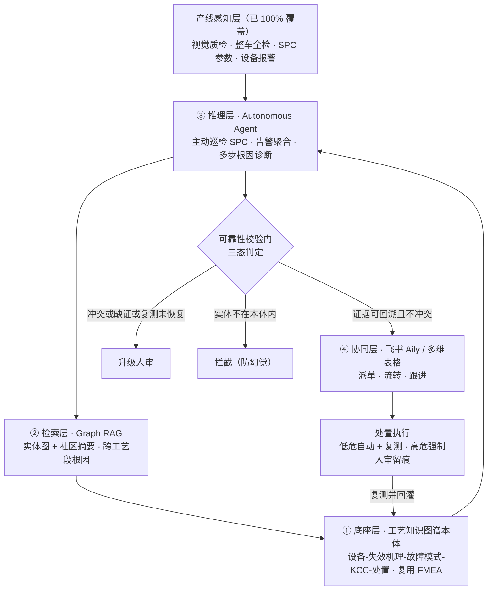

# 质量风险自主管控 AI 数字员工 · 真实可跑的最小系统

> 2026 AI 先锋未来人才大赛 · 赛力斯命题《主动管控设备质量风险的 AI 数字员工》
> 参赛队：安灯常绿队 · 彭罗健 · 2026-07

**🔗 在线可视化 Demo（点开即看、有操作导览、无需装环境）：https://rol1an.github.io/qc-agent-demo/**
页面内嵌真实 Python 引擎跑出的计算结果快照（含 stub 与真 DeepSeek 两份对比），前端零造数据。

**📎 团队补充材料**（答辩备题 / 相关经验 / 数据样本 / 研究笔记 / 参考清单）：[团队补充材料.md](./团队补充材料.md)

---

## 解决什么问题

赛力斯超级工厂的检测能力已近天花板——关键工序 100% 自动化、整车下线逐台全检、一车一档可追溯。"看得见"这件事，基本已经解决。

但瓶颈只是往后退了一步：**报警响起时，它为什么响、要不要停线、该怎么处置，仍然要靠老师傅的经验判断。** 传统工业智能体又大多停在"被动问答"——你问它才答，不会自己发现问题、更不会自己拿主意。

本项目造一名 **AI 数字员工**，接手"检测之后"的那段判断闭环：主动发现异常 → 查清根因 → 给出处置，并让每个判断都**可信、可追溯**。

## 系统架构



**四层 + 一道校验门：**

- **① 底座层 · 工艺知识图谱本体**：把"设备—失效机理—故障模式—KCC（关键控制特性）—处置策略"的因果关系建成本体，直接复用车间现成的 FMEA 与控制计划冷启动，不从零建库。
- **② 检索层 · Graph RAG**：一个报警的根因常横跨多道工序；向量检索按相似度召回单点、容易断链，图检索顺着图谱里的因果链才能把跨工序的根因串全。
- **③ 推理层 · Autonomous Agent**：无报警时主动巡检 SPC 控制图——参数仍在规格内、只是出现连续单边或 Cpk 下滑，就前瞻立案；有异常则多步推理、定位根因、生成带证据链的处置建议。
- **④ 协同层**：接飞书 Aily / 多维表格，把结论落成工单、派单、跟进。
- **🚦 可靠性校验门（三态判定）**——本方案与普通问答智能体最大的差异：把大模型的概率判断收敛成确定结果。证据可回溯且不冲突 → 自动执行低风险处置并复测；证据不足或矛盾 → 转人工；生成实体不在本体内 → 拦截（防幻觉）。停线、改参数等高风险动作一律人工确认、留痕。

## 为什么是真的——每一步都是真计算，不是编排好的动画

| 环节 | 实现 | 真实性 |
|---|---|---|
| 数据 | UCI **SECOM** 真实公开数据集：1567 批次 × 590 传感器 × 3 个月，带真实时间戳与 pass/fail 标签 | ✅ 可下载可核 |
| SPC 引擎 | 真 I-MR 控制限（MR̄/1.128 估 σ）+ 真 Nelson 判异规则 + 滚动 Cpk | ✅ 确定性算法 |
| 知识底座 | NetworkX 真工艺本体（工序→KCC→机理→失效模式→KPC→处置） | ✅ 真图 |
| Graph RAG | 真图检索：无向多跳子图 + 可回溯证据路径（终端质量特性反查会命中**跨工艺段多根因**） | ✅ 真算法 |
| Agent | 可切后端（stub / OpenAI / Ollama）；只提假设，执行权交给 gate | ✅ 接 key 即真 |
| 三态 gate | 确定性代码：A 自动执行+复测 / B 转人审 / C 拦截幻觉 | ✅ 真代码 |

## 为什么用半导体数据证明汽车命题？——这恰恰是诚实

海选阶段拿不到赛力斯真实产线数据。**我们不编造汽车假数据来"演得像"**，而是用真实公开工业数据（SECOM 半导体制造）证明这套**引擎真的跑得通**。引擎与领域解耦：迁移到赛力斯只需替换两处——`data_loader.py` 的数据接口 + `ontology.py` 的工艺本体，其余（SPC / 图检索 / gate）一行不改。这比一个漂亮的假汽车 demo 更有说服力，也更符合"可验证、不编造"。

## 快速运行

```bash
# 需要 uv（https://docs.astral.sh/uv/）；数据已在 data/ 下
uv venv --python 3.14 .venv && source .venv/bin/activate
uv pip install numpy pandas networkx matplotlib

cd src
python run.py          # 端到端真闭环 CLI（默认 stub 后端，本地即可全跑通）
python plot.py         # 生成真实数据 SPC 控制图 → ../control_chart.png
python server.py       # 可视化前端 → 浏览器打开 http://127.0.0.1:8000
```

接**真实 LLM**（除下述环境变量外，代码零改动。key 只走环境变量，切勿写进文件）：

```bash
# DeepSeek（OpenAI 兼容，已实测跑通）
QC_LLM_BACKEND=openai OPENAI_BASE_URL=https://api.deepseek.com \
  OPENAI_API_KEY=你的key QC_MODEL=deepseek-chat python run.py
# 或 OpenAI / 本地开源模型
QC_LLM_BACKEND=openai OPENAI_API_KEY=你的key QC_MODEL=gpt-4o-mini python run.py
QC_LLM_BACKEND=ollama QC_MODEL=qwen2.5 python run.py            # 完全离线
```

> **已用 DeepSeek 实测**：真 LLM 独立推理出的根因是「沉积速率漂移」，与 stub 的「膜厚超差」不同——说明真模型在读检索子图做真推断（选了更上游的失效机理），而非照抄。gate 校验其在本体内 → 走 A 分支自动执行+复测。证明"接真模型后除本环境变量外零改动"。

## 一次真实运行的结果（stub 后端，节选）

```
检出 10 事件: 前瞻 4 / 被动 6
批次#108 [前瞻立案] 连续9点单边  Cpk=1.29 → [A] 自动执行:校正温度/流量补偿；复测已回到受控
批次#275 [被动告警] 点越规格限   Cpk=1.08 → [B] 转人审（CD 反查命中2个跨工艺段失效模式→证据冲突）
幻觉根因『等离子喷涂枪老化』     不在本体内 → [C] 拦截，不下发任何动作
三态分布: {A:5, B:1, C:1}
```

**注意三态分支是真实事件自然触发的，不是我们摆的**：终端质量失效（越规格）因根因横跨多工艺段→证据冲突→转人审；本体外实体→拦截。完整运行见 `sample_run.txt`，控制图见 `control_chart.png`。

## 文件结构

```
src/
  data_loader.py  真实 SECOM 加载 + 数据驱动选过程变量
  spc.py          I-MR 控制限 · Nelson 规则 · 滚动 Cpk · 前瞻立案
  ontology.py     NetworkX 工艺本体 + Graph RAG 图检索
  agent.py        LLM 接口(stub/openai/ollama) + 根因推理
  gate.py         确定性三态 gate + 复测闭环
  run.py          端到端编排 + 终端可视化
  plot.py         真实数据控制图 PNG
  server.py       可视化前端后端（标准库）+ static/
docs/             GitHub Pages 在线 demo（自包含前端 + 真实计算快照）
```

## 诚实声明

- SECOM 是**半导体制造**真实过程数据（传感器匿名）；本体为真实工艺结构，"传感器簇→工序"为数据驱动的演示性映射。
- SECOM 无工程规格限，控制图规格由稳定基线派生（CL±6σ）**仅用于演示**。
- Agent 的 stub 后端基于真实检索结果确定性产出假设，用于本地跑通全管线；接真模型后由真 LLM 推理。
- 数据来源：https://archive.ics.uci.edu/ml/machine-learning-databases/secom/
