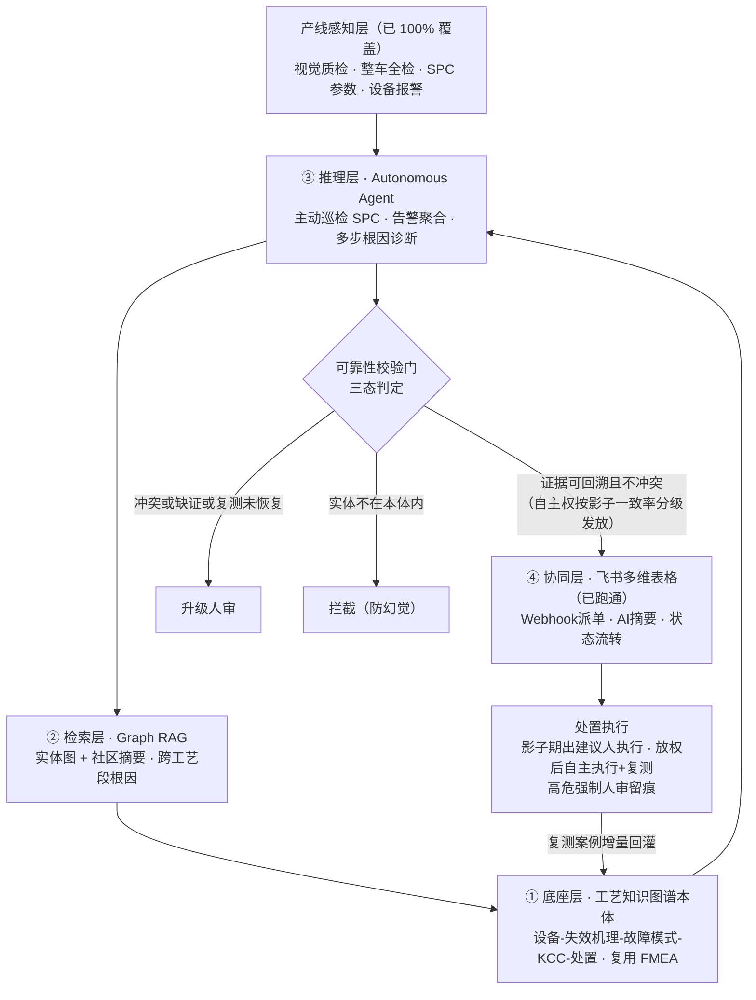

# 质量风险自主管控 AI 数字员工 · 真实可跑的最小系统

> 2026 AI 先锋未来人才大赛 · 赛力斯命题《主动管控设备质量风险的 AI 数字员工》
> 参赛队：安灯常绿队 · 彭罗健 · 2026-07

**🔗 在线可视化 Demo（点开即看、有操作导览、无需装环境）：https://rol1an.github.io/qc-agent-demo/**
页面内嵌真实 Python 引擎跑出的计算结果快照（含 stub 与真 DeepSeek 两份对比），前端零造数据。

**📎 团队补充材料**（答辩备题 / 相关经验 / 数据样本 / 研究笔记 / 参考清单）：[PDF 版](./supplement-pdf/main.pdf) · [Markdown 版](./团队补充材料.md)（LaTeX 源码在 [supplement-pdf/](./supplement-pdf/)，XeLaTeX 可复现编译）

---

## 解决什么问题

赛力斯超级工厂的检测能力已近天花板——关键工序 100% 自动化、整车下线逐台全检、一车一档可追溯。"看得见"这件事，基本已经解决。

但瓶颈只是往后退了一步：**报警响起时，它为什么响、要不要停线、该怎么处置，仍然要靠老师傅的经验判断。** 传统工业智能体又大多停在"被动问答"——你问它才答，不会自己发现问题、更不会自己拿主意。

本项目造一名 **AI 数字员工**，接手"检测之后"的那段判断闭环：主动发现异常 → 查清根因 → 给出处置，并让每个判断都**可信、可追溯**。

## 系统架构


```mermaid
flowchart TD
  S["产线感知层（已 100% 覆盖）<br/>视觉质检 · 整车全检 · SPC 参数 · 设备报警"]
  A["③ 推理层 · Autonomous Agent<br/>主动巡检 SPC · 告警聚合 · 多步根因诊断"]
  B["② 检索层 · Graph RAG<br/>实体图 + 社区摘要 · 跨工艺段根因"]
  C["① 底座层 · 工艺知识图谱本体<br/>设备-失效机理-故障模式-KCC-处置 · 复用 FMEA"]
  G{"可靠性校验门<br/>三态判定"}
  D["④ 协同层 · 飞书多维表格（已跑通）<br/>Webhook派单 · AI摘要 · 状态流转"]
  E["处置执行<br/>影子期出建议人执行 · 放权后自主执行+复测<br/>高危强制人审留痕"]
  H["升级人审"]
  X["拦截（防幻觉）"]
  S --> A
  A --> B
  B --> C
  C --> A
  A --> G
  G -->|"证据可回溯且不冲突<br/>（自主权按影子一致率分级发放）"| D
  G -->|冲突或缺证或复测未恢复| H
  G -->|实体不在本体内| X
  D --> E
  E -->|复测案例增量回灌| C
```

**四层 + 一道校验门：**

- **① 底座层 · 工艺知识图谱本体**：把"设备—失效机理—故障模式—KCC（关键控制特性）—处置策略"的因果关系建成本体，直接复用车间现成的 FMEA 与控制计划冷启动，不从零建库。每次处置的复测结果作为**案例节点增量回灌**本体（设计参考 LightRAG 的 incremental insertion）——"回灌"不是口号，是图上真实可查的节点。
- **② 检索层 · 双层图检索（LightRAG 式）**：一个报警的根因常横跨多道工序；向量检索按相似度召回单点、容易断链。本方案按异常形态分两层检索（设计参考 Guo et al. 2024, LightRAG）——**low-level** 从受监控传感器簇正向查本工序因果链（单因、路径唯一）；**high-level** 从终端质量特性反查跨工艺段多个上游失效模式（多因，冲突信号天然交给 gate）。
- **③ 推理层 · Autonomous Agent**：无报警时主动巡检 SPC 控制图——参数仍在规格内、只是出现连续单边或 Cpk 下滑，就前瞻立案；有异常则多步推理、定位根因、生成带证据链的处置建议。历史复测通过的案例会给同类判断提供可回溯的置信度加成。
- **④ 协同层 · 飞书真闭环（已跑通，非示意图）**：gate 的转人审输出通过多维表格自动化 Webhook **真实派发成工单**——落表、飞书 AI 自动生成处置摘要、状态置"待人审"等人工流转。
- **🚦 可靠性校验门（三态判定 × 影子协同分级放权）**——本方案与普通问答智能体最大的差异：把大模型的概率判断收敛成确定结果，且 **AI 的自主执行权不是天生的，是用数据挣来的**。证据可回溯且不冲突 → 若该类处置已获自主权则自动执行并强制复测，未获自主权则只出影子建议、转人审对照；证据不足或矛盾 → 转人工；生成实体不在本体内 → 拦截（防幻觉）。停线、改参数等高风险动作一律人工确认、留痕。

## "多走一步"到底是哪几步

把工业质量场景里 AI 的能力分成六级，差异区一眼可见：

| 层级 | 这一级要回答什么 | 业界典型做法 | 本项目 |
|---|---|---|---|
| L1 看得见 | 异常有没有被采集到 | 视觉质检、参数采集、SPC 看板 | **已是产线现状**，本项目接在其后 |
| L2 问得出 | 人想查时能不能查到 | 知识库问答、故障手册检索 | 被动——人不问就不动 |
| L3 查得清 | 根因能不能追溯到证据 | 向量 / 图检索做根因推荐 | 双层图检索 + 结论可回溯到图节点 |
| **L4 敢不敢下结论** | 什么时候该说"我不知道" | 多数方案止步于输出置信度 | **确定性三态门**：可回溯放行 / 冲突呼叫 / 幻觉停线 |
| **L5 敢不敢动手** | 凭什么让 AI 自己执行 | 极少涉及 | **影子协同分级放权**，自主权按一致率逐类挣得 |
| **L6 错了怎么办** | 自动动作做错了谁发现 | 几乎空白 | **强制复测 + 一次失败立即收权** |

L1 到 L3 是行业正在做的事，**L4 到 L6 是本项目的差异区**。这三级少有人做的原因是：它们要的不是"让模型更聪明"，而是给概率性模型套上确定性的缰绳——与主流 Agent 范式方向相反。我们承认准确率永远到不了 100%，于是把功夫下在"错的时候会发生什么"上。

## 影子协同 · 分级放权

多数"AI 质检助手"停在**检测后提醒人来处理**。本方案让 AI 先判断这个险情自己能不能解决、能解决就自己上——但自主权按可审计的统计规则分级发放（`shadow.py`）：

1. **影子期**：即使 gate 判定证据齐、置信够，AI 也只出建议，处置仍由人执行；系统逐处置类型累积"AI 建议与产线实际走向"的一致率。
2. **放权**：某类处置样本量达标且一致率过门槛（demo 用 n≥3 且 100%，生产建议 n≥200 且 ≥99%——这是**放权门槛参数，不是效果承诺**），该类处置获得自主执行权。
3. **收权**：自主执行后复测未恢复 → 立即收回该类自主权，退回影子期重新累积。

一次真实运行里这条阶梯**双向走过一遍**，全部由数据驱动、无人工干预：

```
#108 影子(一致) → #133 影子(一致) → #166 影子(一致) ──⚖放权──▶
#196 自主+复测通过 → #421 自主+复测通过 → #475 自主+复测通过 →
#634 自主执行后复测未恢复 ──⚖收权──▶ #644 退回影子期，重新累积
```

**放权阶梯不是单向发放的许可证。**#634 那次自主执行没让产线回到受控，自主权当即被收回——机制会自我纠正。人工负担随一致率上升而下降，但只要出现一次失败，不确定性立刻回到人审这一侧。

## 门限从哪来，换了会怎样

Cpk 门限不是我们定的常数，它按**特性等级**取值——依据 **IATF 16949:2016 条款 8.5.1.5**（特殊特性控制）与 **AIAG-VDA SPC 手册 6.2**：一般特性量产要求 Cpk ≥ 1.33，安全与法规相关的特殊特性（CC/SC，如制动、转向件）优先要求 ≥ 1.67。工艺本体的每个 KPC 节点带 `char_class` 属性，门限随之分档（`spc.CAPABILITY_GATES`）；迁到赛力斯时按质量部门的 APQP 特殊特性清单标注，代码不猜。

同一份数据、同一套控制限与裁决规则，只改门限（`threshold_sensitivity.py`，结果在 `docs/sensitivity.json`）：

| Cpk 前瞻立案门限 | 检出事件 | 其中前瞻立案 | 需人工参与 |
|---|---|---|---|
| 1.33（一般特性） | 10 | 4 | 7 |
| 1.67（安全特殊特性） | 13 | 7 | 9 |

> **更早介入的代价是更多人工工作量**——这条曲线交给质量部门按特性等级取点，我们交付的是机制与口径。

**⚠️ 主动声明一项方法学局限**：Cpk 的计算前提是数据近似正态。对被监控参数全序列做 Jarque-Bera 检验（n=1567）：偏度 +4.73、超值峰度 +62.40、JB=260069.6 ≫ 临界值 5.99，**拒绝正态假设**。据此划清边界——

- **受影响**：Cpk 的绝对值，以及"越 3σ 控制限"（Nelson Rule 1）的标称误报率（3σ↔99.73% 是正态分布的性质）。故本 demo 里 1.33 / 1.67 是**演示用触发线**，不等价于 IATF 语义下的能力判定；按 AIAG-VDA SPC 6.2.3，生产环境须先做 Box-Cox 变换或改用非正态能力算法。
- **不受影响**：前瞻立案依赖的模式判定。Rule 2（连续 9 点位于中心线同侧）在中心线取**中位数**时，每点落在两侧的概率各 50% 由中位数定义保证，与分布形状无关；Rule 3（连续 6 点单调）只用序关系。本项目的控制限正是用中位数作中心线。
- **仍待验证**：SPC 假设观测点相互独立，而传感器序列通常存在自相关，会使判异规则实际误报率高于标称值。生产部署前应做自相关检验，必要时改用残差控制图。

## 对照实验：gate 改变了哪个关键结果

同样的 SECOM 事件流 + 1 例注入幻觉，两种策略对比（`baseline_compare.py`，确定性可复现，结果在 `docs/contrast.json`）：

| 指标 | 纯 LLM 直批（传统做法） | 三态 gate（本方案） |
|---|---|---|
| 自动执行 | 11/11 全执行 | 8（7 有效 + 1 复测捕获升级） |
| **无效下发且无机制发现** | **3（27.3%）** | **0** |
| 幻觉根因被执行 | 1 | 0（本体白名单拦截） |
| 人工介入 | 0 | 3（27.3%，由影子放权随运行递减） |

> 口径：无效=执行后 15 批次内滚动 Cpk 未回 1.33（数据回放）。直批组无复测机制，无效下发无人发现；gate 组执行后强制复测，未恢复即捕获升级人审。

## 为什么是真的——每一步都是真计算，不是编排好的动画

| 环节 | 实现 | 真实性 |
|---|---|---|
| 数据 | UCI **SECOM** 真实公开数据集：1567 批次 × 590 传感器 × 3 个月，带真实时间戳与 pass/fail 标签 | ✅ 可下载可核 |
| SPC 引擎 | 真 I-MR 控制限（MR̄/1.128 估 σ）+ 真 Nelson 判异规则 + 滚动 Cpk | ✅ 确定性算法 |
| 知识底座 | NetworkX 真工艺本体（工序→KCC→机理→失效模式→KPC→处置） | ✅ 真图 |
| Graph RAG | 真图检索：无向多跳子图 + 可回溯证据路径（终端质量特性反查会命中**跨工艺段多根因**） | ✅ 真算法 |
| Agent | 可切后端（stub / OpenAI / Ollama）；只提假设，执行权交给 gate | ✅ 接 key 即真 |
| 三态 gate | 确定性代码：A 自主执行+复测 / B 转人审 / C 拦截幻觉 | ✅ 真代码 |
| 影子放权 | 台账按一致率放权/收权（`shadow.py`）；实测出现 #634 收权，阶梯双向 | ✅ 真代码 |
| 飞书闭环 | 工单经多维表格 Webhook 真实落表，AI 摘要真实生成，状态真实流转 | ✅ 已跑通 |
| 对照实验 | 直批 vs gate 同输入对比，口径与结果可复现（`docs/contrast.json`） | ✅ 确定性 |
| 门限标定 | 分级门限引 IATF 16949 8.5.1.5 条款，敏感性实测（`docs/sensitivity.json`） | ✅ 可复现 |
| 前提校验 | Jarque-Bera 正态性检验（纯 numpy），不通过即如实降级声明 | ✅ 真检验 |

## 为什么用半导体数据证明汽车命题？——这恰恰是诚实

海选阶段拿不到赛力斯真实产线数据。**我们不编造汽车假数据来"演得像"**，而是用真实公开工业数据（SECOM 半导体制造）证明这套**引擎真的跑得通**。引擎与领域解耦：迁移到赛力斯只需替换两处——`data_loader.py` 的数据接口 + `ontology.py` 的工艺本体，其余（SPC / 图检索 / gate）一行不改。这比一个漂亮的假汽车 demo 更有说服力，也更符合"可验证、不编造"。

## 快速运行

```bash
# 需要 uv（https://docs.astral.sh/uv/）；数据已在 data/ 下
uv venv --python 3.14 .venv && source .venv/bin/activate
uv pip install numpy pandas networkx matplotlib

cd src
python run.py               # 端到端真闭环 CLI（默认 stub 后端，本地即可全跑通）
python baseline_compare.py  # 对照实验：纯 LLM 直批 vs 三态 gate
python threshold_sensitivity.py  # 门限敏感性 + Cpk 正态性前提校验
python plot.py              # 生成真实数据 SPC 控制图 → ../control_chart.png
python server.py            # 可视化前端 → 浏览器打开 http://127.0.0.1:8000

# 工单真实派发到飞书多维表格（多维表格自动化 Webhook 触发器地址）
QC_FEISHU_WEBHOOK=https://xxx.feishu.cn/base/automation/webhook/event/xxx python run.py
```

演示 / 录屏时用一键脚本，省得手敲长命令（在仓库根目录跑）：

```bash
./demo.sh              # 完整链路，不派单，最快
./demo.sh --check      # 只验证飞书 webhook 通不通（演示前先跑这个）
./demo.sh --feishu     # 完整链路 + 工单真实派发到飞书
./demo.sh --contrast   # 对照实验 + 门限敏感性，出方案文档要的数字
```

接**真实 LLM**（除下述环境变量外，代码零改动。key 只走环境变量，切勿写进文件）：

```bash
# DeepSeek（OpenAI 兼容，已实测跑通）
QC_LLM_BACKEND=openai OPENAI_BASE_URL=https://api.deepseek.com \
  OPENAI_API_KEY=你的key QC_MODEL=deepseek-chat python run.py
# 或 OpenAI / 本地开源模型
QC_LLM_BACKEND=openai OPENAI_API_KEY=你的key QC_MODEL=gpt-4o-mini python run.py
QC_LLM_BACKEND=ollama QC_MODEL=qwen2.5 python run.py            # 完全离线
```

> **已用 DeepSeek 实测**：真 LLM 独立推理出的根因是「沉积速率漂移」，与 stub 的「膜厚超差」不同——说明真模型在读检索子图做真推断（选了更上游的失效机理），而非照抄。gate 校验其在本体内 → 走 A 分支自动执行+复测。证明"接真模型后除本环境变量外零改动"。

## 一次真实运行的结果（stub 后端，节选）

```
检出 10 事件: 前瞻 4 / 被动 6
批次#108 [前瞻立案] 连续9点单边  Cpk=1.29 → [影子] 建议:校正温度/流量补偿，转人审对照(一致)
批次#166 [前瞻立案] 连续9点单边  Cpk=1.23 → [影子] 对照一致 ⚖『校正温度/流量补偿』3例100% → 放权
批次#196 [被动告警] 点越3σ      Cpk=1.29 → [A] 自主执行；复测回到受控，案例回灌本体
批次#275 [被动告警] 点越规格限   Cpk=1.08 → [B] 转人审（CD 反查命中2个跨工艺段失效模式→证据冲突）
幻觉根因『等离子喷涂枪老化』     不在本体内 → [C] 拦截，不下发任何动作
分支分布: {影子:3, A:2, B:1, C:1}   放权台账: 『校正温度/流量补偿』🟢自主 3例100% (批次#166起)
```

**注意分支是真实事件自然触发的，不是我们摆的**：影子→放权→自主的演进弧线由一致率自然驱动；终端质量失效（越规格）因根因横跨多工艺段→证据冲突→转人审；本体外实体→拦截。完整运行见 `sample_run.txt`，控制图见 `control_chart.png`。

## 文件结构

```
src/
  data_loader.py       真实 SECOM 加载 + 数据驱动选过程变量
  spc.py               I-MR 控制限 · Nelson 规则 · 滚动 Cpk · 前瞻立案
  ontology.py          NetworkX 工艺本体 + LightRAG 式双层图检索 + 案例增量回灌
  agent.py             LLM 接口(stub/openai/ollama) + 根因推理(含历史案例置信加成)
  gate.py              确定性三态 gate + 复测闭环 + 影子放权接入
  shadow.py            影子协同台账：分级放权/收权（自主权按一致率挣得）
  feishu_bridge.py     飞书协同层：转人审/影子工单真实派发到多维表格
  baseline_compare.py  对照实验：纯 LLM 直批 vs 三态 gate（结果→docs/contrast.json）
  threshold_sensitivity.py  门限敏感性 + Cpk 正态性前提校验（结果→docs/sensitivity.json）
  run.py               端到端编排 + 终端可视化
  plot.py              真实数据控制图 PNG
  server.py            可视化前端后端（标准库）+ static/
  gen_snapshot.py      生成 docs/ 内嵌的真实计算快照 + 对照实验数字
docs/             GitHub Pages 在线 demo（自包含前端 + 真实计算快照，7 道工序导览含影子放权演进带与对照实验）
```

## 诚实声明

- SECOM 是**半导体制造**真实过程数据（传感器匿名）；本体为真实工艺结构，"传感器簇→工序"为数据驱动的演示性映射。
- SECOM 无工程规格限，控制图规格由稳定基线派生（CL±6σ）**仅用于演示**。
- Cpk 的正态性前提在本数据上**未通过**（Jarque-Bera，见上）；其绝对值不作能力判定，1.33/1.67 在 demo 里是触发线而非 IATF 语义下的能力门限。判异所依赖的 Nelson Rule 2/3 不受此影响，理由见上节。
- KPC 特性等级（general / special）在 demo 里按半导体工艺自身的关键性标注，**不是**赛力斯的特殊特性清单；迁移时由质量部门按 APQP 给出。
- Agent 的 stub 后端基于真实检索结果确定性产出假设，用于本地跑通全管线；接真模型后由真 LLM 推理。
- 影子期"AI 建议与实际走向的一致"以数据回放中人工处置后的复测结果为代理口径；放权阈值（n≥3、100%）是 demo 门槛参数，生产环境按质量体系另配，**不构成效果承诺**。
- 数据来源：https://archive.ics.uci.edu/ml/machine-learning-databases/secom/
- 设计参考：Guo, Z. et al. (2024). *LightRAG: Simple and Fast Retrieval-Augmented Generation*. arXiv:2410.05779（EMNLP 2025 Findings 收录）——借其双层检索与增量插入机制；本项目在自建工艺本体上实现同型机制，**未引入其库**，且检索层路由改为确定性规则（按 SPC 事件形态选层）而非 LLM 抽关键词。
- 标准依据：IATF 16949:2016 条款 8.5.1.5（特殊特性控制）、AIAG-VDA SPC 手册 6.2 / 6.2.3（能力指数分级门限与非正态数据处理）、Nelson, L.S. (1984). *The Shewhart Control Chart—Tests for Special Causes*. Journal of Quality Technology（判异规则）。
